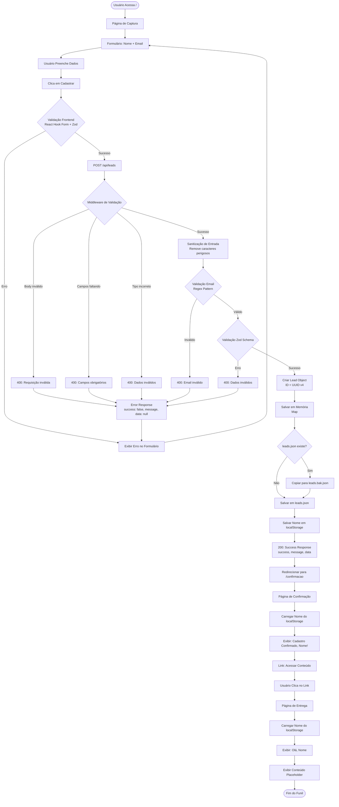
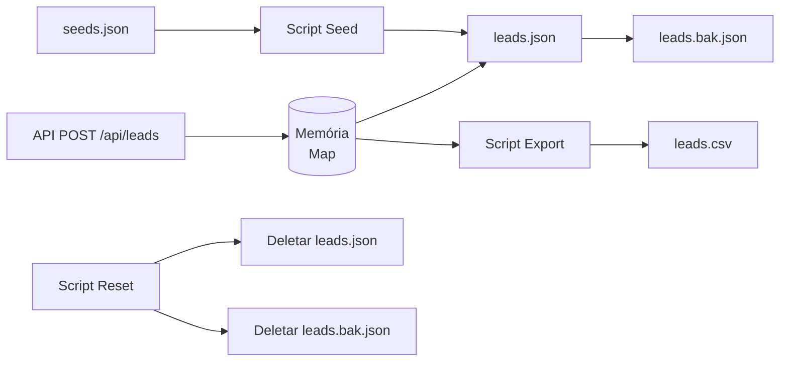
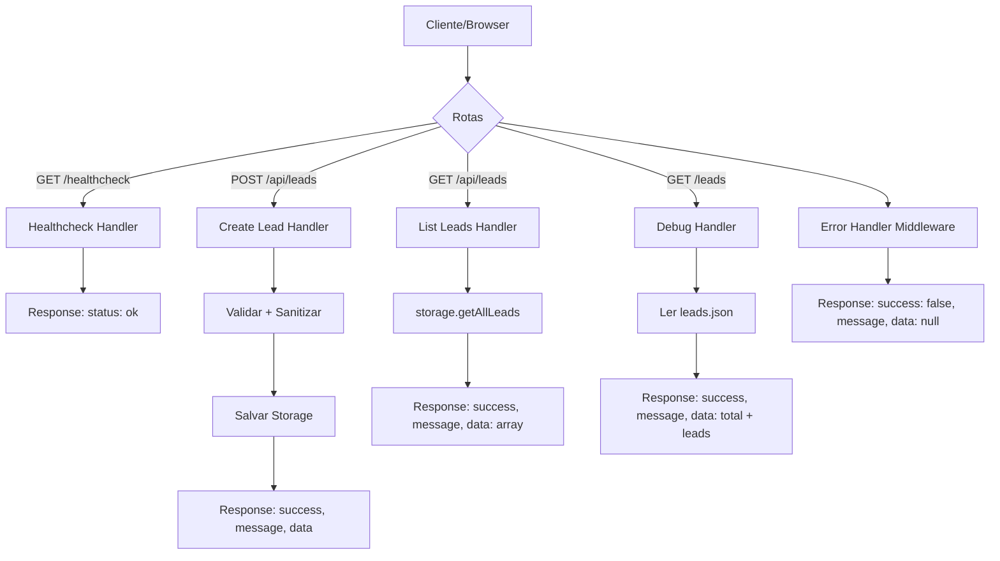
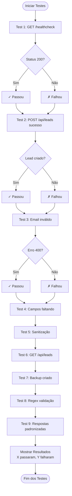
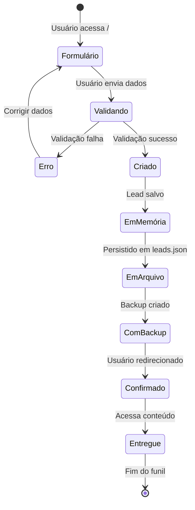
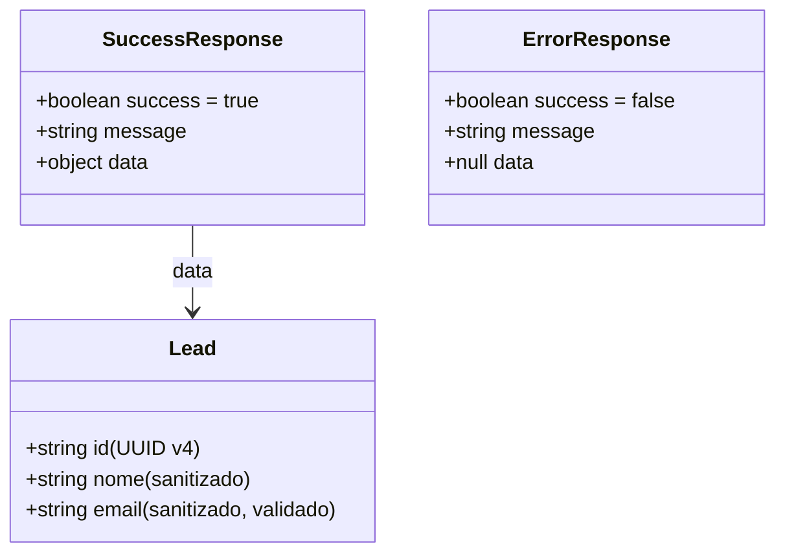
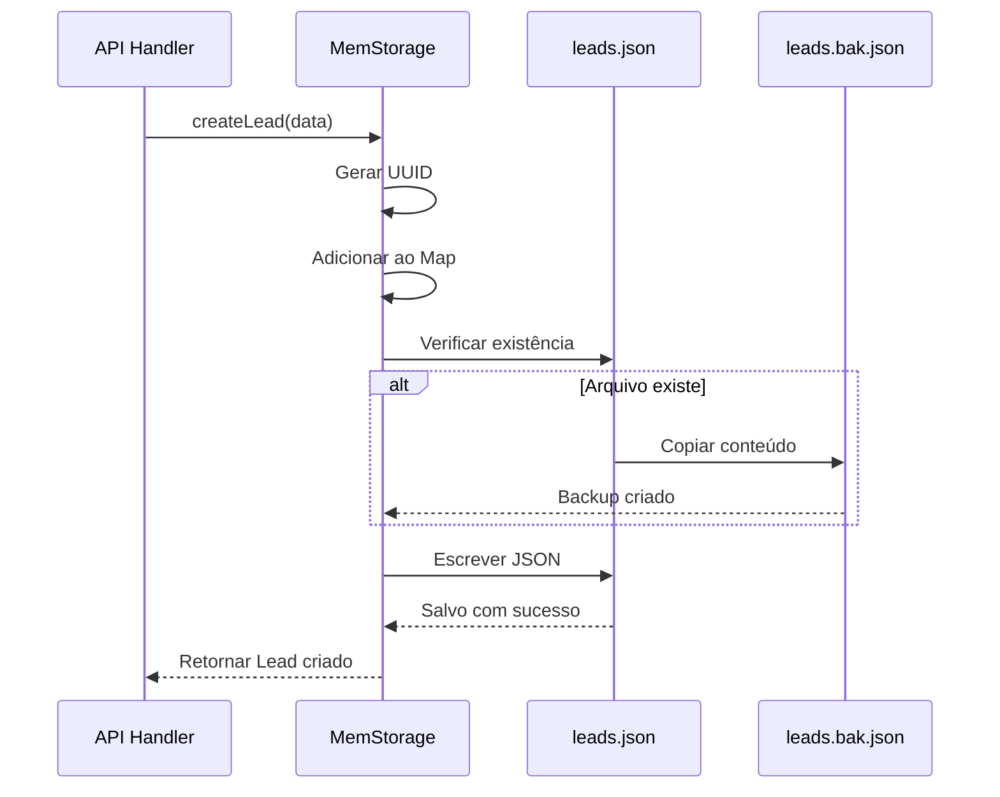

# Diagrama de Fluxo do Funil de Captura

## Fluxo Completo do Funil



## Fluxo de Dados - Armazenamento



## Validação em Camadas

```mermaid
flowchart TD
    Input[Dados de Entrada] --> Layer1[Camada 1: Middleware]
    Layer1 --> Check1{Body existe?<br/>Campos presentes?<br/>Tipos corretos?}
    Check1 -->|Não| Reject1[Rejeitar: 400]
    Check1 -->|Sim| Layer2[Camada 2: Sanitização]
    
    Layer2 --> Clean[Remove: < e ><br/>Trim espaços]
    Clean --> Layer3[Camada 3: Email Regex]
    
    Layer3 --> Check2{Email válido?<br/>/^[^\s@]+@[^\s@]+\.[^\s@]+$/}
    Check2 -->|Não| Reject2[Rejeitar: 400 Email inválido]
    Check2 -->|Sim| Layer4[Camada 4: Zod Schema]
    
    Layer4 --> Check3{Schema válido?}
    Check3 -->|Não| Reject3[Rejeitar: 400 Dados inválidos]
    Check3 -->|Sim| Accept[Aceitar e Processar]
```

## Rotas da API



## Fluxo de Testes Manuais



## Ciclo de Vida do Lead



## Estrutura de Resposta Padronizada



## Backup e Recuperação


